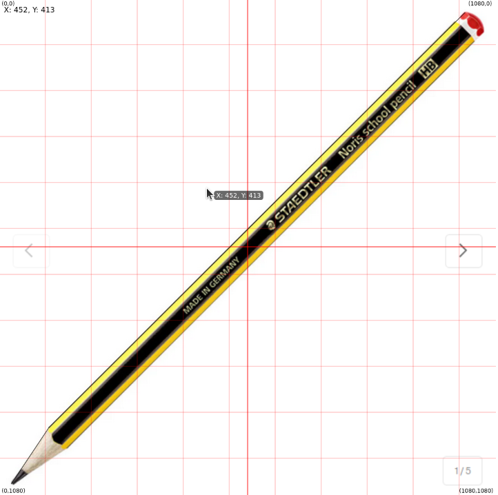

# p5_template



## Overview

**p5_template** is a starter template for projects built with [p5.js](https://p5js.org/). This template is designed for rapid prototyping and creative coding, making it easy to start new visual projects with helpful features out of the box.

## Features

- **Reference Images:** Easily incorporate reference images by placing them in the `assets` folder.
- **Guide Grids:** Display grid overlays to help with alignment and composition.
- **Axis Guides:** Show visual guides for the X and Y axes.
- **Toggle Layers:** Show or hide the grid and axis layers using keyboard shortcuts for a customizable workspace.

## Getting Started

1. **Clone this repository**:
   ```bash
   git clone https://github.com/PoulLorca/p5_template.git
   ```

2. **Add your reference images** to the `assets` folder.

3. **Open `index.html`** in your browser to start your project.

## Keyboard Shortcuts

- **Show/Hide Grid:** Toggle the visibility of the grid overlay.
- **Show/Hide Axes:** Toggle the visibility of the X and Y axis guides.

*(See the code or documentation for the exact keyboard shortcuts.)*

## Example Output

The following image demonstrates the template in action, featuring a reference image with grid and axis guides enabled:


## Folder Structure

```
p5_template/
├── assets/        # Place your reference images here
├── index.html     # Starter HTML file
├── sketch.js      # Main p5.js sketch file
├── style.css      # Styling for your project
└── README.md      # Project documentation
```

## Customization

- Add or remove reference images as needed.
- Adjust grid or guide settings in the JavaScript code to fit your project requirements.

## License

This project is provided as-is for educational and creative use.

---
Made with [p5.js](https://p5js.org/)